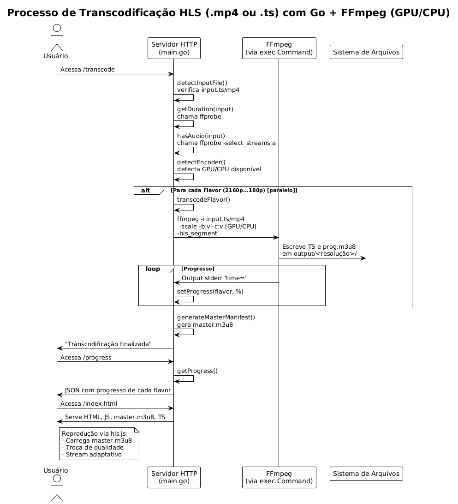

🎞️ HLS Transcoder (Go + FFmpeg (CPU/GPU) )
================================

**Este projeto foi criado com fins educacionais**, para aprender como funciona o processo completo de **transcodificação de vídeo adaptativa para HLS** utilizando `FFmpeg` e `Go`.

* * *

🚀 O que ele faz
----------------

*   Recebe um vídeo de entrada (`.mp4` ou `.ts`)
*   Gera múltiplos "flavors" (resoluções): de `2160p` a `180p`
*   Cria arquivos segmentados `.ts` e playlists `.m3u8` para cada resolução
*   Gera um **manifesto adaptativo** `master.m3u8` com todas as versões
*   Inclui um player HTML

* * *

🛠️ Tecnologias usadas
----------------------

*   **Go** – servidor HTTP + execuções paralelas com goroutines
*   **FFmpeg** – transcodificação real dos vídeos
*   **HLS.js** – reprodução do vídeo HLS no navegador com seletor de qualidade
*   **Docker** - para rodar o projeto.

* * *

▶️ Como rodar
-------------

1.  Coloque um vídeo em `input/input.mp4` ou `input/input.ts`
2.  Execute o projeto com:
    `docker compose up`
3.  No navegador, acesse:
    *   `http://localhost:8080/transcode` → inicia a transcodificação
    *   `http://localhost:8080/hls.html` → player
    *   `http://localhost:8080/progress` → retorna o progresso % de cada flavor

* * *

## ⚙️ Processamento Paralelo

Este projeto utiliza **execução paralela com goroutines** para acelerar o processo de transcodificação. Cada resolução de vídeo (ex: 2160p, 1080p, 720p, etc.) é processada simultaneamente, aproveitando ao máximo os núcleos da CPU disponíveis.

### 🔄 Como funciona:
- Cada tarefa de transcodificação é executada em uma **goroutine separada**.
- O uso de `sync.WaitGroup` garante que o programa aguarde a finalização de todas as resoluções antes de continuar.
- Isso permite ganhos significativos de performance, especialmente em servidores com múltiplos núcleos.

> ✅ Resultado: Transcodificações muito mais rápidas do que um processamento sequencial.

* * *

⚠️ Limitações
-------------

*   Funciona **apenas com HLS** (não gera arquivos para DASH, CMAF, WebM etc.)
*   Não faz upload via navegador (input deve estar no diretório local)
*   Não possui persistência ou banco de dados
*   Não aplica DRM

* * *

📚 Objetivo
-----------

Este projeto foi feito durante um estudo prático sobre transcodificação, streaming adaptativo (ABR), containers de mídia e servidores simples em Go.

* * *
🧪 Teste Local CPU
--------------------------------
### 📽️ Detalhes do Vídeo de Entrada

*   **Duração:** 2 minutos e 50 segundos
*   **Resolução:** 3840x2160 (4K UHD)
*   **Codec de vídeo:** VP9 (Profile 0)
*   **Codec de áudio:** AAC (stereo, 127 kbps)
*   **Frame rate:** 29.97 fps
*   **Tamanho do arquivo:** 193.873.781 bytes (~193,9 MB)
*   **Bitrate médio:** ~9.991 kbps
*   **Arquivo de entrada:** `input.mp4`
*   **Data de criação:** 24/05/2025 (via metadata)

⚙️ Transcodificação
----------------------------

*   **Tempo total:** 15 minutos e 48.60 segundos

### 📤 Flavors gerados

| Qualidade | Resolução   | Bitrate alvo | Caminho de saída    |
|-----------|-------------|--------------|---------------------|
| 2160p     | 3840x2160   | 14.000 kbps  | `output/2160p`      |
| 1080p     | 1920x1080   | 6.000 kbps   | `output/1080p`      |
| 720p      | 1280x720    | 3.000 kbps   | `output/720p`       |
| 480p      | 854x480     | 1.000 kbps   | `output/480p`       |
| 360p      | 640x360     | 600 kbps     | `output/360p`       |
| 180p      | 320x180     | 300 kbps     | `output/180p`       |

### 💾 Uso de Disco
*   **Total gerado:** 558,6 MB
*   **Itens gerados:** 182 arquivos
* * *

🧪 Teste Local CPU (<=360p | GPU > 360p)
--------------------------------
### 📽️ Detalhes do Vídeo de Entrada

*   **Duração:** 2 minutos e 50 segundos
*   **Resolução:** 3840x2160 (4K UHD)
*   **Codec de vídeo:** VP9 (Profile 0)
*   **Codec de áudio:** AAC (stereo, 127 kbps)
*   **Frame rate:** 29.97 fps
*   **Tamanho do arquivo:** 193.873.781 bytes (~193,9 MB)
*   **Bitrate médio:** ~9.991 kbps
*   **Arquivo de entrada:** `input.mp4`
*   **Data de criação:** 24/05/2025 (via metadata)

⚙️ Transcodificação
----------------------------

*   **Tempo total:** 4 minutos e  25.98 segundos

### 📤 Flavors gerados

| Qualidade | Resolução   | Bitrate alvo | Caminho de saída    |
|-----------|-------------|--------------|---------------------|
| 2160p     | 3840x2160   | 14.000 kbps  | `output/2160p`      |
| 1080p     | 1920x1080   | 6.000 kbps   | `output/1080p`      |
| 720p      | 1280x720    | 3.000 kbps   | `output/720p`       |
| 480p      | 854x480     | 1.000 kbps   | `output/480p`       |
| 360p      | 640x360     | 600 kbps     | `output/360p`       |
| 180p      | 320x180     | 300 kbps     | `output/180p`       |

### 💾 Uso de Disco
*   **Total gerado:** 558,6 MB
*   **Itens gerados:** 182 arquivos
* * *